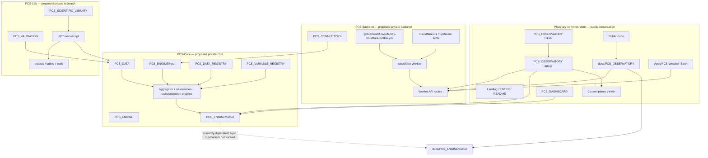
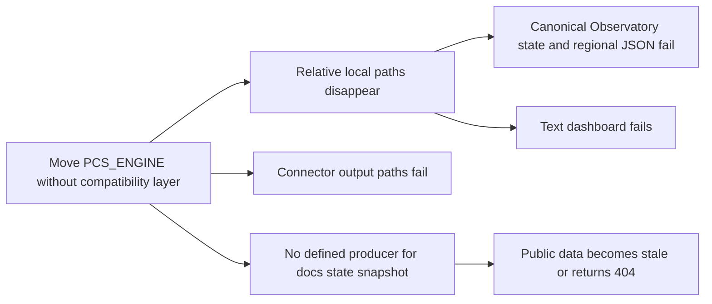
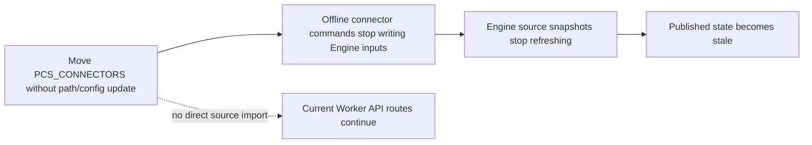
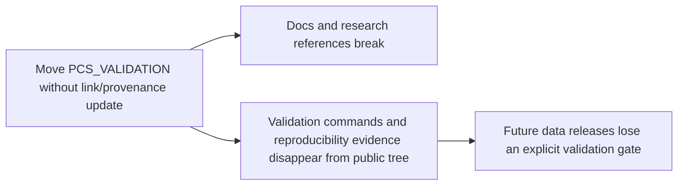
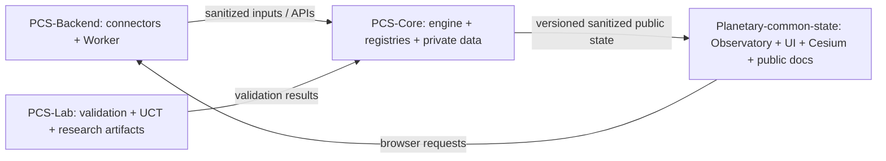

# PCS Dependency Tree

> Analysis only. Snapshot: `55afb69d132dcdf4700064cb58421bf97549a5f3` on `main`. This report describes current tracked paths and likely cut points; it does not move files or change deployment.

## 1. Dependency Summary

| Component | Direct dependants | Frontend / delivery consumer | What the dependency supplies | Move impact without cutover |
| --- | --- | --- | --- | --- |
| `PCS_ENGINE` | `PCS_OBSERVATORY`, `PCS_DASHBOARD`, `PCS_CONNECTORS`, Engine tests, `docs/PCS_ENGINE` publication copy | HTML, JavaScript, Cesium state rendering, docs/Pages | Input contract, aggregation, projection and generated `latest_state` / regional JSON | High: local Observatory and dashboard lose state; publishing can lose its data source |
| `PCS_CONNECTORS` | `PCS_ENGINE/input` and operators running connector scripts | Indirectly HTML/JavaScript/Cesium through Engine output | Converts external datasets into Engine input JSON | Medium now, high over time: deployed pages can keep reading old snapshots, but refresh pipelines stop |
| `PCS_VALIDATION` | Validation reports, research workflow and public explanatory links | docs only; no current browser/runtime import found | Scientific comparison and validation artifacts | Low runtime impact; evidence and reproducibility links break |
| `PCS_DATA` | `PCS_ENGINE/run_engine.py`, Engine tests, `UCT` demonstration cases and copied figures/tables | Indirectly docs and generated outputs | Benchmark, processed/raw research datasets and provenance | High for offline Engine tests/demos and UCT reproducibility; not a direct browser dependency |
| `cloudflare` | GitHub deploy workflow, public frontends using the fixed Worker URL | Worker and API; HTML/JavaScript/React consumers | D1-backed API, upstream proxy endpoints, visitor and science services | Existing deployment may continue, but build/deploy recovery stops; API outage breaks all network panels |
| `UCT` | Root `main.tex`, generated/copy artifacts under `outputs`, `tables`, and `work` | docs/research publication; no browser runtime import found | Manuscript, figures, tables and citations | Low live-site impact; manuscript build and provenance break |

## 2. Dependency Tree

The dashed edge is especially important: the tracked `docs/PCS_ENGINE/output` files are byte-identical to the current Engine output, but no tracked workflow or copy script was found that guarantees future synchronization.

## 3. Required-by Matrix

| Dependant folder / surface | `PCS_ENGINE` | `PCS_CONNECTORS` | `PCS_VALIDATION` | `PCS_DATA` | `cloudflare` | `UCT` |
| --- | --- | --- | --- | --- | --- | --- |
| `PCS_OBSERVATORY` HTML / JavaScript / Cesium | Directly reads Engine output | Indirect refresh source | No runtime dependency | Indirect through Engine | Calls deployed Worker API | No |
| `docs/PCS_OBSERVATORY` / GitHub Pages candidate | Directly reads `docs/PCS_ENGINE/output` | Indirect refresh source | Documentation links only | Indirect through published state | Calls deployed Worker API | Documentation links only |
| `Apps/PCS-Weather-Earth` | No direct import found | No direct import found | No | No | Direct fixed Worker base URL | No |
| `PCS_DASHBOARD` | Directly reads `PCS_ENGINE/output/latest_state.json` | Indirect | No | Indirect | No | No |
| `PCS_ENGINE` | Self | Receives connector output | Separate evidence workflow | Direct benchmark/test paths | No direct dependency | No |
| `PCS_CONNECTORS` | Writes Engine inputs | Self | Has connector-level validation helpers | Uses source-specific data conventions | No direct dependency | No |
| `PCS_VALIDATION` | Validates generated/research results conceptually | May validate connector products | Self | Direct evidence inputs | No | Research relationship |
| `UCT` | Uses model concepts/results | No direct script dependency found | Cites validation/evidence | Direct raw/normalized/processed/metadata references | No | Self |
| `.github/workflows` | No | No | No | No | Direct deployment dependency | No |
| `outputs`, `tables`, `work` | Generated/copy relationship | No | Evidence relationship | Figure/table provenance | No | Direct manuscript build relationship |

## 4. Frontend and Delivery Surfaces

### HTML

- `PCS_OBSERVATORY/index.html` loads the canonical Observatory JavaScript and UI assets.
- `docs/PCS_OBSERVATORY/index.html` is the documentation/Pages candidate and depends on its sibling published data paths.
- Moving either served HTML tree without first changing the publishing source or copying a public build artifact produces missing pages or missing assets.

### JavaScript

- `PCS_OBSERVATORY/app.js` sets `GLOBAL_STATE_SOURCE` to `../PCS_ENGINE/output/latest_state.json` and loads regional state from `../PCS_ENGINE/output/regions`.
- `docs/PCS_OBSERVATORY/app.js` resolves the equivalent published `docs/PCS_ENGINE/output` paths.
- Both Observatory variants and the React weather layer configuration call `https://pcs-backend.uranusastudio.workers.dev`; the source tree location does not insulate the browser from Worker/API failure.

### Cesium

- Cesium itself does not import Python Engine code. It consumes the JSON state and region outputs through Observatory JavaScript.
- Therefore the safe boundary is a versioned public data contract: keep sanitized, generated JSON publicly addressable while private Engine implementation moves elsewhere.

### Worker

- `cloudflare/src/index.js` and `cloudflare/src/nasa/*` implement the Worker independently of `PCS_ENGINE`, `PCS_CONNECTORS`, and `PCS_VALIDATION` imports.
- `cloudflare/wrangler.toml`, `package.json`, migrations/schema, tests, and source files form one deployment unit and should not be split during migration.
- Tracked `.wrangler/cache` and `.wrangler/tmp` content is generated operational residue, not a deployable dependency; regenerate it rather than replicate it.

### API

- Browser-facing routes include astronomy, space weather, visitor registration/statistics/locations/analytics/ping, OpenWeather health/tiles, and NASA proxy/data routes.
- Worker source also exposes state/data routes such as `/latest`, `/variables`, and `/ingest/v1`.
- Removing `PCS_CONNECTORS` does not directly remove these deployed routes. It removes offline ingestion capabilities feeding the file-based Engine pipeline.

### docs

- `docs/PCS_OBSERVATORY` is a public presentation copy, while `docs/PCS_ENGINE/output` is a public state snapshot.
- These copies must be treated as generated release artifacts with an explicit producer, schema, sanitization gate, and publish job before private source directories are removed.
- Public architecture, developer, Observatory and Engine documentation can remain only after links and implementation details are reviewed for the intended public boundary.

## 5. Evidence for Critical Edges

| From | To | Evidence in repository | Risk |
| --- | --- | --- | --- |
| `PCS_OBSERVATORY/app.js` | `PCS_ENGINE/output` | Relative `GLOBAL_STATE_SOURCE` and regional output prefix | Immediate state/region load failure if output disappears |
| `docs/PCS_OBSERVATORY/app.js` | `docs/PCS_ENGINE/output` | Equivalent relative published paths | Immediate Pages data failure if published output disappears |
| `PCS_DASHBOARD/text_dashboard.py` | `PCS_ENGINE/output/latest_state.json` | Direct file path read | Dashboard fails to load current state |
| Connector scripts | `PCS_ENGINE/input/*.json` | Hard-coded `Path(...)/PCS_ENGINE/input` destinations | Connector runs fail or write to a nonexistent old path |
| `PCS_ENGINE/run_engine.py` | `PCS_DATA/processed/demo_annual_dataset.csv` | Default benchmark path | Default benchmark execution fails |
| Engine tests | `PCS_DATA` | Test fixtures/paths use project data | Test suite loses fixtures and regression inputs |
| `UCT/09_demonstration_cases.tex` | `PCS_DATA` | References processed, normalized, raw and metadata data | Manuscript cannot reproduce demonstration cases |
| `.github/workflows/deploy-cloudflare-worker.yml` | `cloudflare` | Trigger and working directory point to `cloudflare/**` | Future Worker deployment fails after an uncoordinated move |
| Observatory and React configuration | Deployed Worker | Fixed `pcs-backend.uranusastudio.workers.dev` URL | Network-backed panels fail if API is unavailable |
| `PCS_ENGINE/output` | `docs/PCS_ENGINE/output` | Current files match byte-for-byte; no tracked publisher found | Silent public snapshot drift after separation |

## 6. Deployment Failure Trees

### If `PCS_ENGINE` moves now

The browser does not need private Python source, but it does need stable public output URLs. Move implementation only after introducing an explicit export/publish contract and temporary compatibility path.

### If `PCS_CONNECTORS` moves now

No currently deployed Worker API was found importing `PCS_CONNECTORS`; the immediate failure is the offline ingestion pipeline, not the already deployed API binary.

### If `PCS_VALIDATION` moves now

Current HTML, Cesium, Worker and API runtime paths do not import `PCS_VALIDATION`, so the live site should not immediately fail. The loss is scientific assurance, documentation integrity and release gating.

## 7. Safe Cutover Gates

Before changing any boundary, the future migration phases should require all of the following:

1. Define a versioned public JSON schema and an allowlist-based exporter from `PCS-Core` to the public repository.
2. Replace hard-coded cross-folder paths with explicit configuration or package/API contracts.
3. Identify the actual GitHub Pages source and make `PCS_OBSERVATORY` versus `docs/PCS_OBSERVATORY` a single canonical build path.
4. Add an automated, reviewed synchronization job for public Engine snapshots; fail on stale or schema-incompatible output.
5. Move the complete Cloudflare deployment unit and its workflow together, while leaving secrets only in the deployment platform.
6. Exclude `.wrangler/cache`, `.wrangler/tmp`, bytecode and other generated residue from replication.
7. Run link, static asset, JSON fetch, Cesium rendering, Worker route, connector, Engine and manuscript checks before removing compatibility copies.
8. Remove old copies only after production and Pages smoke tests prove the replacement paths are live.

## 8. Proposed Boundary Direction

This direction preserves a narrow public contract: the presentation repository receives reviewed release artifacts and calls documented public APIs; it does not contain the private computation, ingestion, operational deployment, or research workspaces that produce them.
